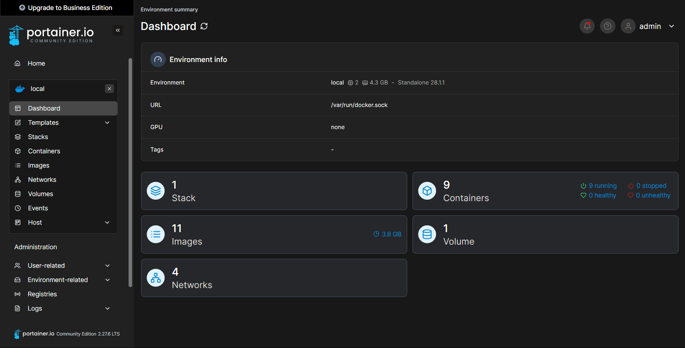

# Docker installation on LXC Container with Portainer

Docker with Portainer can be configured on an LXC Container using the very helpful Proxmox VE Helper script

**Step 1**:  Grab the installation command from [here](https://community-scripts.github.io/ProxmoxVE/scripts?id=docker) and run it in the Proxmox VE Host Shell. When it asks for Portainer installation select *y* and proceed.

**Step 2**: Navigate to to https://<docker_lxc_ip>:9443 and setup portainer credentials

That's it! Its pretty simple :)

*(Setup [tailscale](../Tailscale/Readme.md) and map the each of the services that u r gonna run on docker containers  to custom domains using [NPM](../Nginx_Proxy_Manager/Readme.md) for improving QoL)*