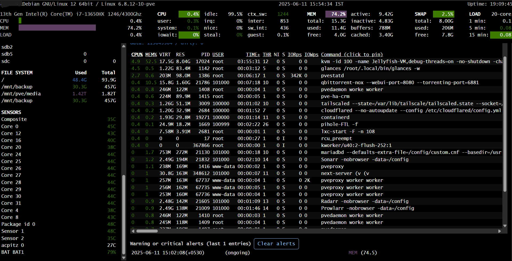

# Glances Installation & Setup 

Glances is an amazing tool to monitor the resource usage and condition of all your resources that and it is integrated well with gethomepage.dev dashboards.

<center></center>

 Here's the fastest way how you can set it up on your machine

**Step 1**: Install pipx 
```bash
apt install pipx
```
**Step 2**: Install glances
```bash
pipx install 'glances[all]'
```

- That's it :) Glances will now be installed in /home/<your_username>/.local/bin  
- To add Glances to the PATH, follow the onsceen instructions after Step 2  
- To execute glances, just run ./glances and it'll pull up *(glances -w if you want web mode. Access it via http://<VM_IP>:61208 )*
- To secure it with a username and password, do checkout the [glances docs](https://glances.readthedocs.io/en/latest/quickstart.html)

***Bonus***: I've added a systemctl service file so that you dont need to start it manually after rebooting.
- Place it in /etc/systemd/system cus that's where custom unit files are placed.
- Perform a daemon reload with `systemctl daemon-reload`
- Start the service with `systemctl start glances`
- Enable it to start the service automatically upon boot `systemctl enable glances`

