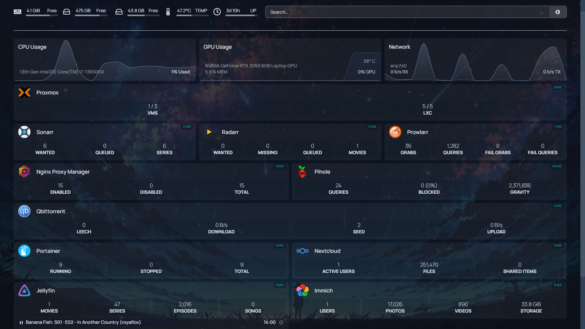
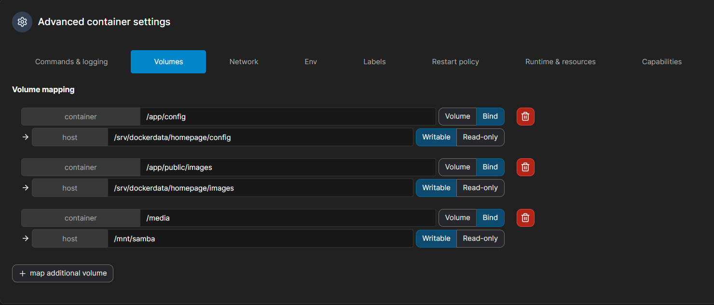

# Aesthetic Homelab Dashboard setup and config

Navigate to the Docker LXC (checkout [docker_portainer](../Docker_Portainer/Readme.md) incase you don't have a Docker LXC) and as a good practice create 2 folders for bind mounts,

- one for storing the config — /srv/dockerdata/homepage/config
- Other for the background image —/srv/dockerdata/homepage/images  

Next, in portainer with

- ghcr.io/gethomepage/homepage:latest as the image,
- map port 3000 to 3000 and
- Configure volumes as below 👇

(The last mount is of my external hard drive that I’ve passed to monitor it)

Pass HOMEPAGE_ALLOWED_HOSTS: <host_name or ip:port> (and also PGID and PUID) env variables, if required
Deploy the container and once its up and running, you will be able to access it at http://<docker_lxc_ip>:3000

Now, navigate to /srv/dockerdata/homepage/config. You will find many yaml files. Out of these, we'll be looking at  
- services.yaml : The main file for adding services
- settings.yaml : For managing the layout of dashboard
- widgets.yaml : For managing the tiny widgets on top

 Add your preferred image to /srv/dockerdata/homepage/images and reference it as shown in settings.yaml. *( You need to restart your container for images to show up on the site )*

I have all these files included above. Feel free to modify it and use it according to your needs :)

*(Glacnes has been installed on Proxmox host as well Ubuntu Server VM for resource monitoring. Incase you don't have them then [here](../Glances/Readme.md) is a quick guide on setting it up)*

*(Setup [tailscale](../Tailscale/Readme.md) on the Docker LXC and map the service to a custom domain using [NPM](../Nginx_Proxy_Manager/Readme.md) for improving QoL)*