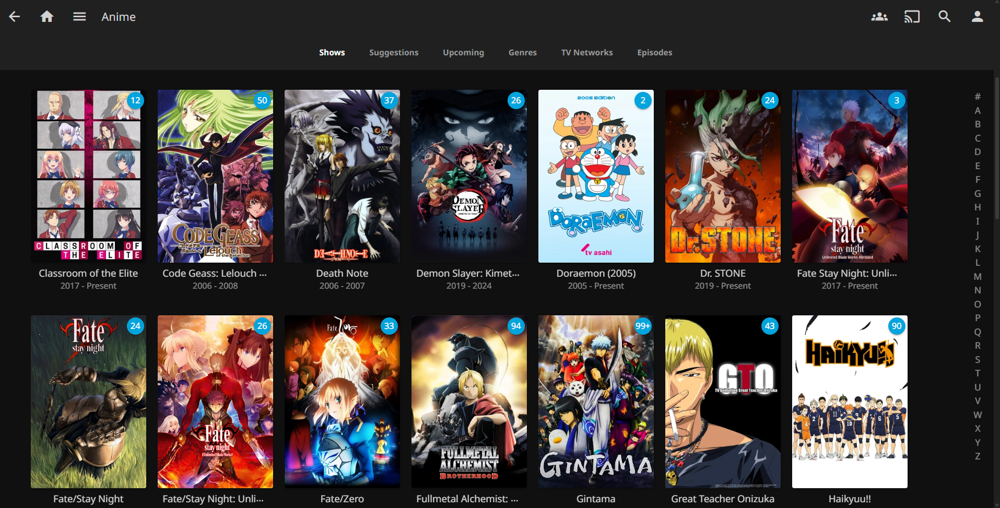

# Jellyfin Installation and Setup on an Ubuntu Server VM

First off, why did I choose to put it separately on a VM rather than having it on an LXC?  
Cus I wanted to do a GPU passthrough to enable Hardware Encoding for my media essentially letting me play a wide variety of media over all my devices  

Can't I do a GPU Passthrough via LXC?  
Its certainly possible but I also intend to utilize this GPU for Immich. Hence I preferred having all the services that require GPU in a single place  

<center></center>

Okay so coming to Jellyfin Installation,

**Step 1**: Configure an Ubuntu Server VM, by downloading the [server image](https://ubuntu.com/download/server) from here and spin up a VM with required RAM and Storage

**Step 2**: If you have any external media drives that you need to attach, which I have in my case, do a USB Passthrough and mount it in the VM after installing Ubuntu Server

**Step 3**: If you need to passthough NVIDIA GPU then go through my guide over [here](https://abhyudayjkm.medium.com/passing-nvidia-gpu-to-vm-in-proxmox-4a69c9195d6e)

**Step 4**: Install Jellyfin via a one-liner 
```bash

curl -s https://repo.jellyfin.org/install-debuntu.sh | sudo bash

```
*(This even configures the jellyfin service such that it runs as soon as the system boots)*

**Step 5**: Now access Jellyfin via http://<vm_ip>:8096 and configure the initial stuff. Incase you've mounted an external drive, select the right folder in the mount point when setting up the media folder for library

**Step 6**: To setup Hardware Accelerated Encoding, Click on your user icon --> Dashboard --> Playback --> Transcoding and in Hardware Acceleration select NVIDIA NVENC and select the decoding and encoding formats that your graphic card allows.


- *Setup [tailscale](../Tailscale/Readme.md) if you need to access it remotely and securely and also [Nginx Proxy Manager](../Nginx_Proxy_Manager/Readme.md) incase you need to access it via a domain name instead of IP Address*  

- *Also note that just turning TvDB on and having the rest unchecked for downloading the metadata works the best*

- *In my case, I've used an external HDD for storing Jellyfin and Immich media. So once its been mounted in the host with appropriate UID and GID, I'm accessing it in this VM using VirtIO 9p share. Add the arg as shown [here](../Proxmox/VM_Config/qemu-server/Ubuntu_Server_VM.conf) and upon rebooting the VM, mount it to the desired location using `mount -t 9p -o trans=virtio myshare /mnt/hostdrive` or better add `myshare /mnt/hostdrive 9p trans=virtio,version=9p2000.L 0 0` to /etc/fstab for it to mount to the VM at /mnt/hostdrive automatically everytime upon boot*

- *On the host, I've mounted it by adding `/dev/sdb1 /mnt/pve/media ntfs-3g rw,soft,sync,intr,uid=1000,gid=1000 0 0` to /etc/fstab.  (Have a look at architecture diagram for more clarity) Note that this procedure is gonna slightly change depending on your hard drive file system.*


