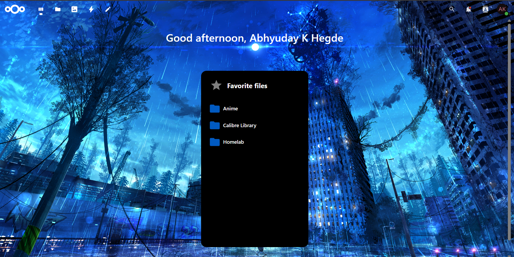
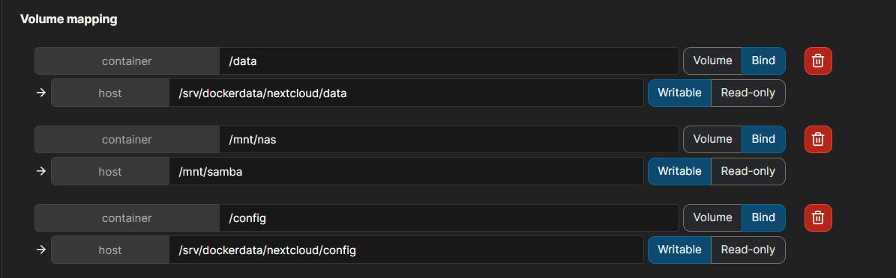
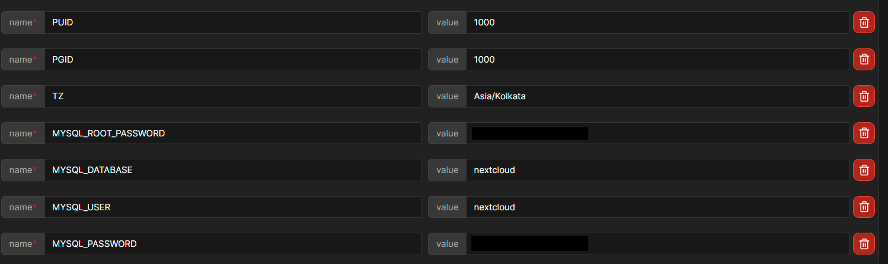

# Nextcloud installation and setup

Nextcloud provides an amazing GUI for managing your files remotely and here's how you can set it up. Here's how you can set it up in a docker container through portainer.

  

**Step 1** : Deploy nextcloud container with 
- lscr.io/linuxserver/nextcloud:latest as the image
- Set PUID and PGID env variables to 1000 and TZ to your corresponding time zone(Eg:Asia/Kolkata)
- Map port 443 to 443
- Add a config volume and data volume. (I've even bind mounted my external hard drive at /mnt/nas of the container so that I can access it via nextcloud)

**Step 2** : Now we need a database for nextcloud (to store user information, administrative details etc) and that is gonna be served my MariaDB. So, deploy another container with
- lscr.io/linuxserver/mariadb:latest as the image
- Add the following env variables

- Add a config volume. I've bind mounted a folder of my LXC in a similar manner as I did for Nextcloud container

- Map port 3306 to 3306

**Step 3** : Navigate to https://<docker_lxc_ip>, port 443 by default to setup nextcloud admin account. During the setup, database host is gonna be <docker_lxc_ip>:3306

That's it! Your are good to go :)

*(Setup [tailscale](../Tailscale/Readme.md) in Docker LXC and map the nextcloud to a custom domain using [NPM](../Nginx_Proxy_Manager/Readme.md) for improving QoL)*  
*(Now setup 2FA and try downloading mobile app and configuring that too, its ez dw)*

