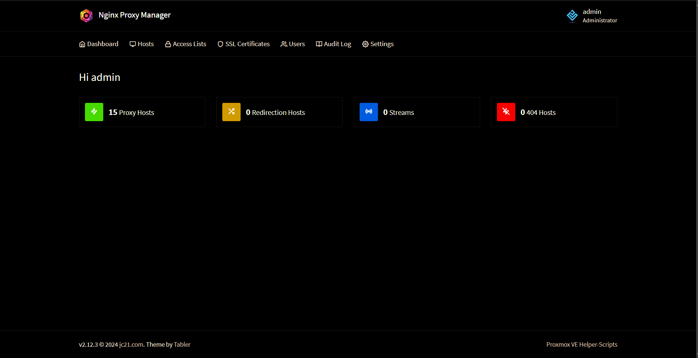

# Nginx Proxy Manager in LXC

Once again, a huge shoutout to tteck and Proxmox VE Helper Scripts Community for providing amazing one liner installers for NPM

**Step 1** : Start off by running the installation command present over [here](https://community-scripts.github.io/ProxmoxVE/scripts?id=nginxproxymanager) in you Proxmox Host Shell and proceed with the default installation. 

**Step 1.1** : Install Tailscale in the LXC as explained [here](../Tailscale/Readme.md)

**Step 2** : Navigate to http://<lxc_ip>:81 and login using the default credentials (mentioned in the Proxmox VE Helper scripts page) 

**Step 3** : Now, we need to add an SSL Certificate to all our services so that we can access them over https using our domain names. I have cloudflare configured as the Nameserver for my domain and the process is gonna be similar regardless of your NS. Navigate to your NS provider's dashboard and add
- A CNAME record pointing * to your root domain *(like homepage.xyz)*
- An A record pointing your root domain to your nginx lxc tailscale IP Address

**Step 4** : In NPM dashboard, add a Lets Encrypt SSL Certificate. Enable DNS Challenge and upon choosing your DNS Provider, follow the onscreen instructions. Incase of Cloudflare, you need to generate an API Token from the Cloudflare Dashboard and paste it here.

**Step 5** : Now you can add proxy hosts and select this generated SSL cert for all the added proxies. *(Enable Force SSL and HTTP/2 Support when selecting SSL Cert)* This also eliminates the need to generate a separate cert for each service hosted :)
