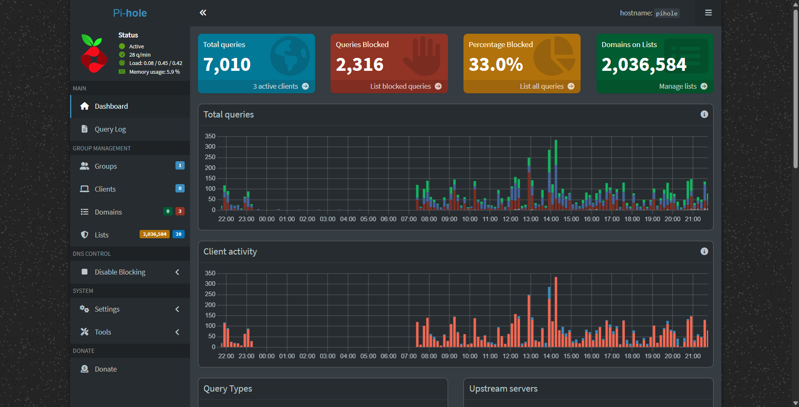

# Pi-Hole installation and setup

A really straight forward setup all thanks to tteck and proxmox VE helper scripts community!

**Step 1**: Grab the installation command from [here](https://community-scripts.github.io/ProxmoxVE/scripts?id=pihole) and run it in the Proxmox VE Host Shell. 

**Step 2**: In your Pi-Hole LXC Container console, type *pihole setpassword* to set the passowrd for loggin into Pi-Hole web interface. 

**Step 3**: In the Wifi settings of you client devices, add the IP Address of the Pi-Hole LXC container as the DNS Server

