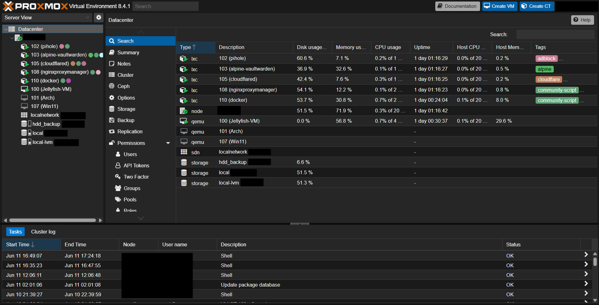

# Proxmox Host Setup ✨

For those who don't know, Proxmox Virtual Environment is a complete open-source platform for enterprise virtualization. With the built-in web interface you can easily manage VMs and containers, software-defined storage and networking, high-availability clustering, and multiple out-of-the-box tools using a single solution.

  

**Beware: Installing Proxmox in the main drive of the PC is going to delete all the data in the respective drive FOREVER.**

**Beware: Creating a bootable USB is gonna format it i.e. delete all its data permanantly**

For installing it on your spare PC,

**Step 1**: Download the official ISO file from [here](https://www.proxmox.com/en/downloads) and create a bootable USB *(I prefer using [Rufus](https://rufus.ie/en/) for this)*

**Step 2**: Plug it into your spare laptop, fire it up, choose boot from USB from the boot menu after pressing your bootmenu key asthough you r in a CPS competition.*(Look up in google for ur device's bootkey. It varies with the manufacturer)*

**Step 3**: Follow the on screen instructions and install Proxmox with the default settings

**Step 4**: Once the installation is done, the device that has Proxmox Installed is just gonna have a terminal. Login with default username i.e. *root* and the password that you've set. Now you can navigate to the Proxmox VE Web GUI using the URL shown on screen after loggin in.*(Generally https://<host_ip>:8006)*

And its done. You have Proxmox hypervisor up and running :)

*(Its gonna give a connection is not secure thingy but dw, just click on advanced and proceed as we'll be setting up SSL Certs later using [NPM](../Nginx_Proxy_Manager/Readme.md) and [Tailscale](../Tailscale/Readme.md) too for remote access)*

- ***(Note: Config files of all the LXC containers and VM's have been added above)***
- *I've mounted two hard drives on to the Proxmox Host, one for taking backup periodically and the other for Media storage(I've passed this one to the Ubuntu Server VM as well as a few LXCs. Have a look at their conf files and architecture diagram for a better idea)*
