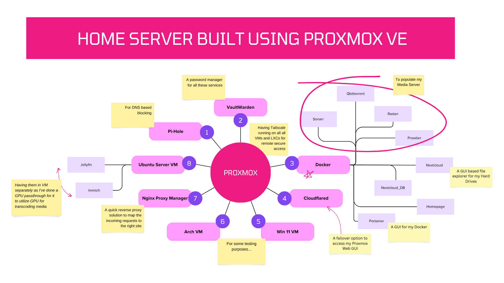
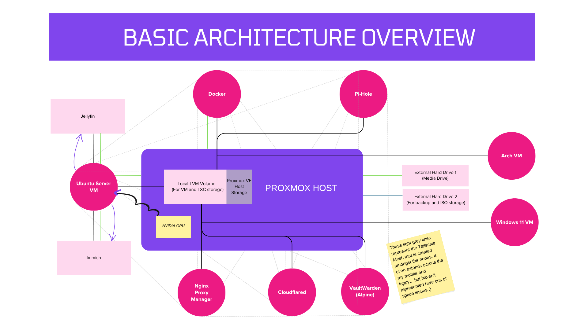

<h1 align="center">My Homelab Setup ✨</h1>

So I spent a little over a month configuring my spare laptop as my home-server and learnt a lot along the way. A huge shoutout to tteck and [Proxmox VE helper scripts](https://community-scripts.github.io/ProxmoxVE/scripts) community!

I've distilled my month long efforts into this repo, I hope to help fellow homelabbers who are starting out, by providing a few config files, links and some quick walkthroughs just so you can save a some hours incase you want to build one similar to this.  

So here's an overview of the services that's running on my home-server right now 👇  

  

- The ones that don't have VMs specifically mentioned are running on LXC Containers.

- All of these services have tailscale running and hence any device within my tailnet (The devices that are connected to Tailscale VPN) can access these services remotely, without the need for port forwarding

Here's another diagram to give you an overview of the **Storage architecture and Tailscale**

## What do each of the deployed containers and VMs do? 

*(Navigate to the individual folders to have a look at its final setup, config and installation instructions)*  

**1. [Pi-Hole](https://pi-hole.net/)** : This offers Network-level Ad blocking which allows you to block ads in non-traditional places such as mobile apps and smart TVs, regardless of hardware or OS. Unlike browsers that block ads at Application Level, Pi-Hole blocks it at Network level essentially preventing it from even reaching the devices  

**2. [Vaultwarden](https://github.com/dani-garcia/vaultwarden)** : A robust self-hosted password manager solution that is built upon Bitwarden. It offers autofill in websites on laptop, using the browser extension as well as in mobile devices once the app has been configured.

**3. Docker LXC**: Inside a Docker LXC, I've configured the below services

- **[Portainer](https://www.portainer.io/)**: For managing all my docker containers using GUI 

- **[Sonarr](https://sonarr.tv/)** : For auto downloading anime and other weekly shows according to its air schedule

- **[Radarr](https://radarr.video/)** : Same as Sonarr but for downloading Movies 

- **[Prowlarr](https://prowlarr.com/)**: Indexer manager (Basically tells Radarr and Sonarr where should it find stuff from) 

- **[Qbittorrent](https://www.qbittorrent.org/)**: The download client which actually downloads them into my Hard-Drive

- **[Nextcloud](https://nextcloud.com/)**: As my Hard-Drive remains connected to the server, Nextcloud offers a GUI file explorer to help access my drive from all the devices in my tailnet.*(Yes, my phone too)*

- **[Homepage](https://gethomepage.dev/)**: A container that helps me host a beautiful webpage for monitoring all my services

**4. [Cloudflared](https://developers.cloudflare.com/cloudflare-one/connections/connect-networks/)** : For creating tunnels so that I can access my Proxmox Web Console for outside my local network and Tailnet incase Tailscale goes down.

**5. [Windows 11 VM](https://medium.com/@abhyudayjkm/nvidia-mobile-gpu-passthrough-to-windows-11-vm-in-proxmox-error-43-and-anti-cheat-issues-resolved-9d45b448fab5)** : To try out different viruses :)

**6. [Arch Linux VM](https://github.com/HyDE-Project/HyDE)** : For testing out different rices :))

**7. [Nginx Proxy Manager](https://nginxproxymanager.com/)**: Provides a neat looking interface for setting up reverse proxy to each one of my hosted services, pointing domain names to IP addresses.

**8. [Ubuntu Server VM](https://ubuntu.com/download/server)** : Runs two services with one being on docker. These two have been isolated since I'm utilizing hardware accelaration for a few of their processes by passing through NVIDIA RTX 3050 GPU and this largely benefits their performance

- **[Jellyfin](https://jellyfin.org/)** : Media Manager that arranges all my Anime, TV-Shows and Movies and gives me a Premium Netflix like interface by including metadata of the shows. This has an Android as well as IOS app so that you can literally access it from all of you devices without any hassle..

- **[Immich](https://immich.app/)** : A feature rich photo manager for photos and videos offering a clean UI. Even has ML models inbuilt for face detection. *No more 15GB limits :)*. This has a mobile app too. Just enter you immich-server address and the app is ready!

*(For Cloudflare configuration, have a look at my Medium page over [here](https://medium.com/@abhyudayjkm/providing-remote-access-to-proxmox-host-da3940a116e3)... Rest of the services' configs are mentioned above. Planning to add a few more services soon.)*

<h1 align="center">Happy homelabbing:)</h1>
