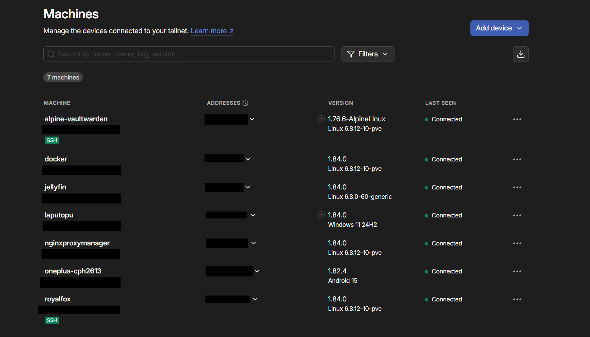

# Tailscale Setup and Installation

## What is Tailscale?  
Tailscale is a software-defined, secure network built on top of WireGuard, that's used to connect devices, users, and services across different networks securely and privately. It allows users to create encrypted point-to-point connections, essentially creating a private LAN over the internet

<center></center>

## Why use Tailscale?
To access all the services that you are hosting, remotely but securely such that only those devices that have Tailscale installed on them and are connected to the Tailscale VPN (what is termed as as 'being inside a Tailnet') will be able to access them. You also have the option to configure ACLs *(Access Controll Lists)* abiding by PoLP *(Principle of Least Previlage)*

## How to install Tailscale on my devices?

- First, create an account in [Tailscale](https://tailscale.com/). Then navigate to their [downloads](https://tailscale.com/download) page.

- For Windows and Android, its just straight forward installation, just follow the procedure on the downlaod page and authenticate it via the web browser

- For Linux too, they have a one liner installation and a straight forward procedure but the problem arises when you have to install it on an LXC Container

## Installing Tailscale on an LXC Container

The tailscale service fails to start in LXC Containers because it requires certain Linux capabilities (like CAP_NET_ADMIN, access to /dev/net/tun, etc.) that are not available by default in LXC containers — especially unprivileged ones.  

So what do we do? We add the following lines to our corresponding lxc configs at /etc/pve/lxc in the Proxmox host

```bash

lxc.cgroup2.devices.allow: c 10:200 rwm
lxc.mount.entry: /dev/net/tun dev/net/tun none bind,create=file

```

### What are these lines doing?
It allows the container to access a character device with major number 10 and minor number 200 — which is: /dev/net/tun → the TUN (network TUNnel) device, allowing programs like Tailscale, WireGuard, or OpenVPN to create virtual network interfaces inside the container.  
The second line bind-mounts the host’s TUN device into the container at /dev/net/tun making sure the TUN device exists inside the container.


