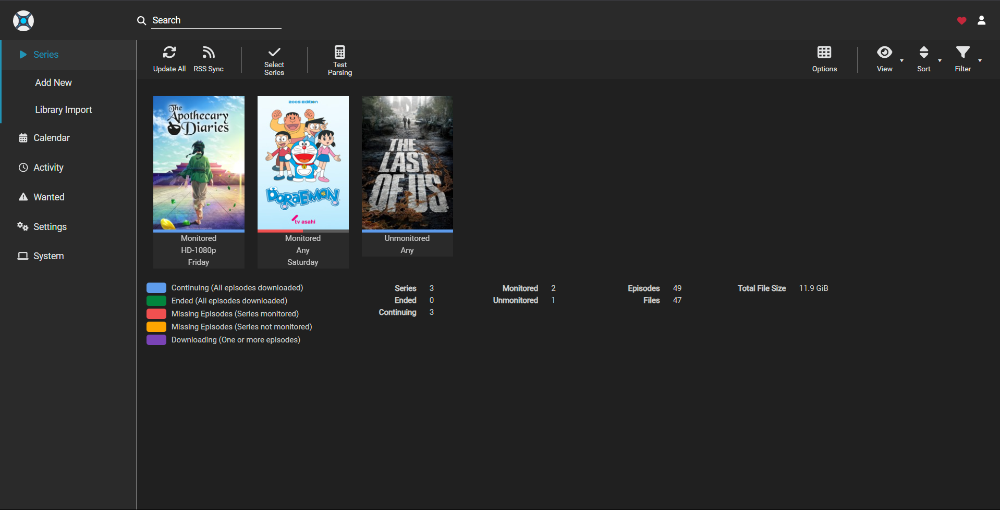
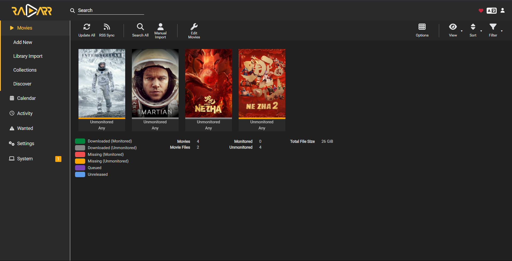
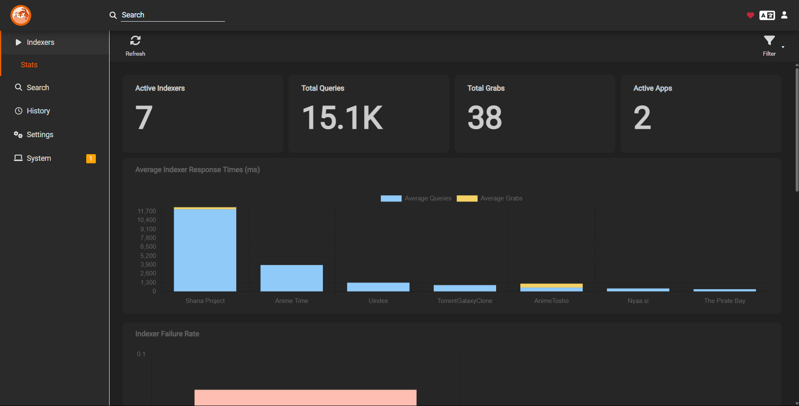

# Sonarr, Radarr and Prowlarr Setup with Qbittorrent

- I have these running as a media-server stack in portainer. 
- Checkout how my drives are connected (Have a look at my architecture diagram) and configured on Proxmox VE (Config file over [here](../Proxmox/LXC_Config/lxc/docker.conf)) so that you can modify it according to the paths in your drive and add the stack to portainer
- Here is it's compose file  :)  
- Once it has been deployed, add the root folder through Settings --> Media Management (check below in config) in both sonarr and radarr

Here is how it's gonna look after the configuration!

<center></center>
<center></center>
<center></center>  


And this is the stack that you r gonna be deploying

```yaml

services:
  sonarr:
    image: lscr.io/linuxserver/sonarr:latest
    container_name: sonarr
    environment:
      - PUID=1000
      - PGID=1000
      - TZ=Asia/Kolkata
    volumes:
      - /srv/dockerdata/sonarr/data:/config  # On my docker LXC 
      - /mnt/samba/ABHI/Homelab/Sonarr/Anime:/media # HDD folder where the downloaded Qbittorrent files of Sonarr get copied to (This /Anime is gonna be a root folder)
      - /mnt/samba/ABHI/Homelab/Qbittorrent:/downloads # Default download folder for qbittorrent again mapped to my HDD
    ports:
      - 8989:8989
    restart: unless-stopped


  radarr:
    image: lscr.io/linuxserver/radarr:latest
    container_name: radarr
    environment:
      - PUID=1000
      - PGID=1000
      - TZ=Asia/Kolkata
    volumes:
      - /srv/dockerdata/radarr/data:/config  # On my docker LXC
      - /mnt/samba/ABHI/Homelab/Radarr:/Movies  # HDD folder where the downloaded Qbittorrent files of Radarr get copied to (This /Movies is gonna be a root folder)
      - /mnt/samba/ABHI/Homelab/Qbittorrent:/downloads # Default download folder for qbittorrent again mapped to my HDD
    ports:
      - 7878:7878
    restart: unless-stopped


  prowlarr:
    image: lscr.io/linuxserver/prowlarr:latest
    container_name: prowlarr
    environment:
      - PUID=1000
      - PGID=1000
      - TZ=Asia/Kolkata
    volumes:
      - /srv/dockerdata/prowlarr/data:/config   # On my docker LXC
    ports:
      - 9696:9696
    restart: unless-stopped
    
  qbittorrent:
    image: lscr.io/linuxserver/qbittorrent:latest
    container_name: qbittorrent
    environment:
      - PUID=1000
      - PGID=1000
      - TZ=Asia/Kolkata
      - WEBUI_PORT=8080
      - TORRENTING_PORT=6881
    volumes:
      - /srv/dockerdata/qbitorrent/config:/config  # On my docker LXC
      - /mnt/samba/ABHI/Homelab/Qbittorrent:/downloads  # Default download folder for qbittorrent mapped to my HDD
    ports:
      - 8080:8080
      - 6881:6881
      - 6881:6881/udp
    restart: unless-stopped

```
*Note: Make sure to disable CSRF protection option in Qbittorrent-->Tools-->Options-->WebUI or else I found that proxying thorugh NPM doesn't work. If yk the reason, pls lemme know*
