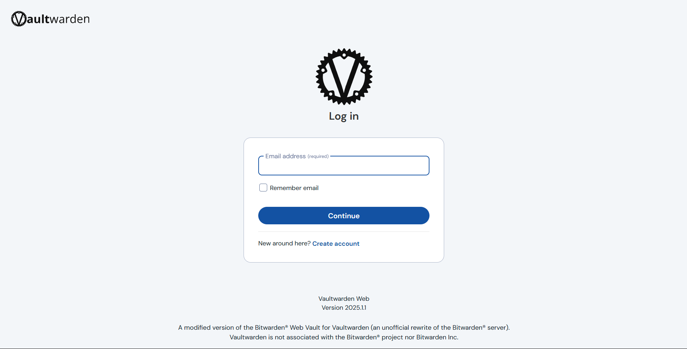

# VaultWarden Setup 

VaultWarden provides a cross-platform password management service and has a really straight forward setup, again thanks to the Proxmox VE Helper scripts  

**Step 1**: Grab the installation command from [here](https://community-scripts.github.io/ProxmoxVE/scripts?id=vaultwarden) and run it in the Proxmox VE Host Shell. Its worth noting that the alpine linux version consumes fewer resources compared tot he default one.

**Step 2**: Proceed with the default installation settings and note the LXC IP address.

**Step 3**: Upon installation, navigate to the container and type *update* inorder to set the admin token

**Step 4**: Now, on visiting IP of the container and you should see the vaultwarden login page up and running. (*Note that you need to visit https://<vm_ip>:8000 and not the http version of it!*)

**Step 5**: If needed, install tailscale on the LXC Container and add a proxy using Nginx Proxy Manager so that you can access it remotely within the tailnet and also get a valid SSL certificate.

**Step 6**: Install bitwarden browser extension (and bitwarden mobile app) and while configuration, select self-hosted and type in the URL or your vaultwarden server. Login with the same credentials and enable 2FA for extra security.
